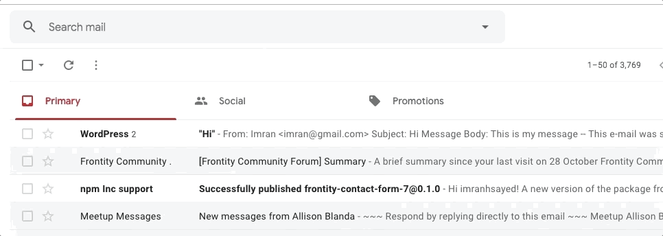

# Frontity Contact Form 7 :art:

:fire: Contact Form 7 package for Frontity.

******* PLEASE STAR MY REPO TO SUPPORT OUR WORK 🙏 ******

Please follow me 🙏 on [twitter](https://twitter.com/imranhsayed) and github

# :video_camera: Demo CF7 Form


# :video_camera: Demo CF7 Form Email received


#### Below is the screentshot taken with Frontity mars theme with some added styles. The styles may look different for your Frontity theme. 


# How does it work?

1. You need to create a page in your WordPress site (if you don't already have one) that contains a CF7 shortcode.
1. Install the Frontity Contact Form 7 package as shown in the Installation steps below.
1. Visit that page in Frontity and the package will automatically render all the CF7
   forms that are present, including other content on the page.
1. On successful form submission, the email goes to the admin (if CF7 email settings are configured on your WordPress site). Errors are shown as well if the fields are invalid.

> It uses html processors to render the CF7 form.

# Features

1. All the CF7 forms on the page will work.
2. You can also use it for multiple pages.
3. Built with React and Frontity, so its fast and performant.

# Installation :wrench:

1. Do `npm install frontity-contact-form-7` in the root of your project.
1. Add the package name in `frontity-settings.js`.

```javascript
"packages": [
  "frontity-contact-form-7"
  // other packages ...
]
```

3. Run `npx frontity dev` again.

That's it! The package doesn't need any settings. You should be able to see the form in any page or post that contains one.


## More info :clipboard:

This is the beta version. Some features will be added in the final release, like:

1. [Support for all the fields](https://github.com/imranhsayed/frontity-contact-form-7/issues/8).

## Contribute to the package

If you want to contribute to the package, you can do so following these simple steps:

1. Fork this repository (https://github.com/imranhsayed/frontity-contact-form-7).
1. Clone it in your local machine.
1. Run `npm install`.
1. Run `npx frontity dev`.
1. Do the changes to the code.
1. Submit the pull request! :)

You can change the `state.source.api` setting on the `frontity.settings.js` file to point the project to your own WordPress if you want but please do not include those changes in your PR.


## Credits :white_flower:

- Build with love :blue_heart:, using [Frontity's](https://frontity.org)

## Authors

1. [Imran Sayed](https://twitter.com/imranhsayed)
2. [Smit Patadiya](https://twitter.com/smit_patadiya)

## Contributors

1. [Luis Herranz](https://twitter.com/luisherranz) - Leed Developer [@frontity](https://twitter.com/frontity)

## License :scroll:


- **[GPLv2](https://www.gnu.org/licenses/old-licenses/gpl-2.0.en.html)**
